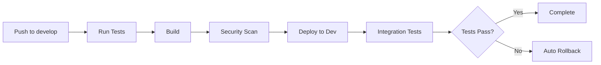
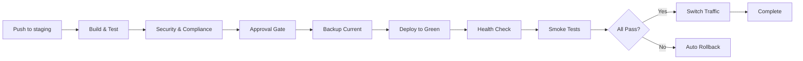

# Deployment Guide

## 📋 Mục lục
- [Tổng quan](#tổng-quan)
- [Môi trường Deployment](#môi-trường-deployment)
- [Quy trình Deploy](#quy-trình-deploy)
- [Blue-Green Deployment](#blue-green-deployment)
- [Canary Deployment](#canary-deployment)
- [Checklist](#checklist)

## 🎯 Tổng quan

Tài liệu này mô tả chi tiết quy trình deployment cho các môi trường khác nhau với focus vào automation, safety, và rollback capability.

## 🌍 Môi trường Deployment

### 1. Development (Dev)
- **Branch**: `develop`
- **Auto Deploy**: Có
- **Approval**: Không
- **Purpose**: Testing tính năng mới
- **URL**: `https://dev.example.com`

### 2. Staging
- **Branch**: `staging` hoặc tags `v*.*.*`
- **Auto Deploy**: Có (sau approval)
- **Approval**: Có (manual gate)
- **Purpose**: Pre-production testing
- **URL**: `https://staging.example.com`

### 3. Production (Future)
- **Branch**: `main` hoặc `master`
- **Auto Deploy**: Có (sau approval)
- **Approval**: Có (multiple approvers)
- **Purpose**: Live production
- **URL**: `https://example.com`

## 🚀 Quy trình Deploy

### Development Environment



**Steps:**
1. Developer push code lên branch `develop`
2. CI/CD tự động trigger
3. Run linting, tests, build
4. Security scanning (dependencies, SAST)
5. Deploy to dev environment
6. Run integration tests
7. Nếu fail → auto rollback

**Command:**
```bash
# Push code
git push origin develop

# Monitor deployment
gh run watch

# Check logs
gh run view --log
```

### Staging Environment



**Steps:**
1. Push code hoặc create release tag
2. Build và comprehensive testing
3. Security scanning và compliance checks
4. **Manual approval required**
5. Backup current deployment
6. Deploy to green environment
7. Health checks và smoke tests
8. Switch traffic (blue → green)
9. Nếu fail → auto rollback

**Command:**
```bash
# Create release tag
git tag -a v1.2.3 -m "Release v1.2.3"
git push origin v1.2.3

# Or push to staging branch
git push origin staging

# Manual approval required in GitHub Actions UI
```

## 🔵🟢 Blue-Green Deployment

### Strategy
Blue-Green deployment giúp zero-downtime deployment và rollback nhanh chóng.

**Architecture:**
```
┌─────────────┐
│  Load       │
│  Balancer   │
└──────┬──────┘
       │
    ┌──┴──┐
    │     │
┌───▼──┐ ┌▼────┐
│ Blue │ │Green│
│ (v1) │ │(v2) │
└──────┘ └─────┘
 Active  Standby
```

### Process

#### 1. Pre-Deployment
```bash
# Backup current state
aws s3 sync s3://app-bucket s3://app-backup-$(date +%Y%m%d)

# Tag current version
git tag -a "blue-stable-$(date +%Y%m%d)" -m "Stable blue version"
```

#### 2. Deploy to Green
```bash
# Deploy to green environment
aws s3 sync ./dist s3://app-green-bucket

# Verify green environment
curl https://green.example.com/health
```

#### 3. Testing on Green
```bash
# Run smoke tests
npm run test:smoke -- --url=https://green.example.com

# Run load tests
artillery quick --count 100 --num 10 https://green.example.com
```

#### 4. Switch Traffic
```bash
# Update load balancer target
aws elbv2 modify-target-group-attribute \
  --target-group-arn $GREEN_TG_ARN \
  --attributes Key=deregistration_delay.timeout_seconds,Value=30

# Switch traffic
aws elbv2 modify-listener \
  --listener-arn $LISTENER_ARN \
  --default-actions Type=forward,TargetGroupArn=$GREEN_TG_ARN
```

#### 5. Monitor
```bash
# Monitor metrics
watch -n 5 'curl -s https://api.example.com/metrics | jq'

# Check error rates
aws cloudwatch get-metric-statistics \
  --namespace AWS/ApplicationELB \
  --metric-name HTTPCode_Target_5XX_Count
```

#### 6. Keep Blue as Standby
- Giữ blue environment trong 24-48h
- Nếu có issue, switch back ngay lập tức

## 🐤 Canary Deployment

### Strategy
Deploy version mới cho 5-10% traffic trước, monitor, sau đó tăng dần.

**Traffic Distribution:**
```
v1 (old): ████████░ 90%
v2 (new): █░░░░░░░░ 10%

After monitoring:
v1 (old): ██████░░░ 70%
v2 (new): ████░░░░░ 30%

After more monitoring:
v1 (old): ░░░░░░░░░ 0%
v2 (new): █████████ 100%
```

### Implementation

#### 1. Deploy Canary
```bash
# Deploy canary version
kubectl set image deployment/app \
  app=myapp:v2 \
  --record

# Set canary traffic to 10%
kubectl patch service app-service \
  -p '{"spec":{"selector":{"version":"canary"}}}'
```

#### 2. Monitor Key Metrics
```yaml
Metrics to Watch:
- Error rate: < 1%
- Response time: < 500ms (p95)
- CPU usage: < 70%
- Memory usage: < 80%
- Request success rate: > 99%
```

#### 3. Gradual Rollout
```bash
# Increase to 25%
update_traffic_split 25

# Wait 30 minutes, monitor
sleep 1800

# Increase to 50%
update_traffic_split 50

# Wait 30 minutes, monitor
sleep 1800

# Full rollout
update_traffic_split 100
```

## ✅ Deployment Checklist

### Pre-Deployment
- [ ] Code reviewed và approved
- [ ] All tests passing
- [ ] Security scan clean
- [ ] Changelog updated
- [ ] Database migrations prepared (if any)
- [ ] Feature flags configured
- [ ] Rollback plan documented
- [ ] Stakeholders notified
- [ ] Maintenance window scheduled (if needed)

### During Deployment
- [ ] Backup current state
- [ ] Monitor deployment progress
- [ ] Check health endpoints
- [ ] Run smoke tests
- [ ] Verify key features
- [ ] Monitor error rates
- [ ] Check performance metrics
- [ ] Verify database connections

### Post-Deployment
- [ ] Full regression test
- [ ] Monitor for 1 hour minimum
- [ ] Check logs for errors
- [ ] Verify monitoring/alerting
- [ ] Update documentation
- [ ] Notify stakeholders of completion
- [ ] Keep rollback option available for 24h
- [ ] Document any issues

### Rollback Triggers
- [ ] Error rate > 5%
- [ ] Response time > 2x baseline
- [ ] CPU/Memory critical alerts
- [ ] Database connection failures
- [ ] Critical feature broken
- [ ] Security vulnerability discovered

## 📊 Monitoring During Deployment

### Key Metrics Dashboard
```yaml
Application Metrics:
  - Request rate (requests/sec)
  - Error rate (%)
  - Response time (p50, p95, p99)
  - Throughput (MB/s)

Infrastructure Metrics:
  - CPU utilization (%)
  - Memory usage (%)
  - Disk I/O
  - Network I/O

Business Metrics:
  - User sign-ups
  - Transactions completed
  - Revenue impact
  - User complaints
```

### Alert Thresholds
```yaml
Critical:
  - Error rate > 5%
  - Response time p95 > 2s
  - CPU > 90%
  - Memory > 95%

Warning:
  - Error rate > 1%
  - Response time p95 > 1s
  - CPU > 70%
  - Memory > 80%
```

## 🔧 Troubleshooting

### Deployment Stuck
```bash
# Check pipeline status
gh run view $RUN_ID

# Check logs
gh run view --log $RUN_ID

# Check resource status
terraform show
kubectl get pods -n production
```

### Health Check Failing
```bash
# Check endpoint
curl -v https://app.example.com/health

# Check logs
kubectl logs -f deployment/app

# Check events
kubectl get events --sort-by=.metadata.creationTimestamp
```

### Performance Degradation
```bash
# Check metrics
aws cloudwatch get-metric-statistics ...

# Check slow queries
# In database
SHOW PROCESSLIST;

# Check memory
kubectl top pods

# Check network
netstat -an | grep ESTABLISHED | wc -l
```

## 📚 References

- [GitHub Actions Documentation](https://docs.github.com/en/actions)
- [AWS Deployment Best Practices](https://aws.amazon.com/architecture/well-architected/)
- [Blue-Green Deployment](https://martinfowler.com/bliki/BlueGreenDeployment.html)
- [Canary Releases](https://martinfowler.com/bliki/CanaryRelease.html)
